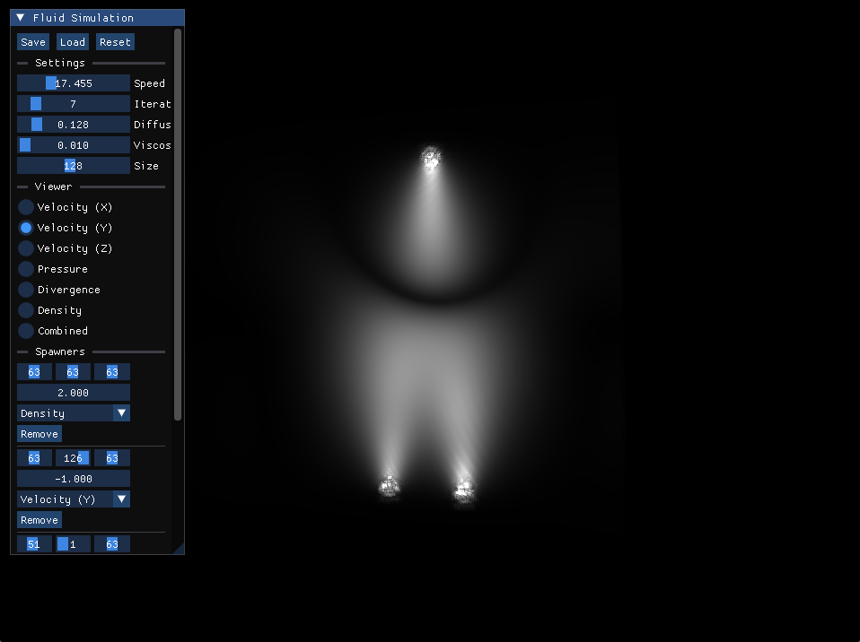
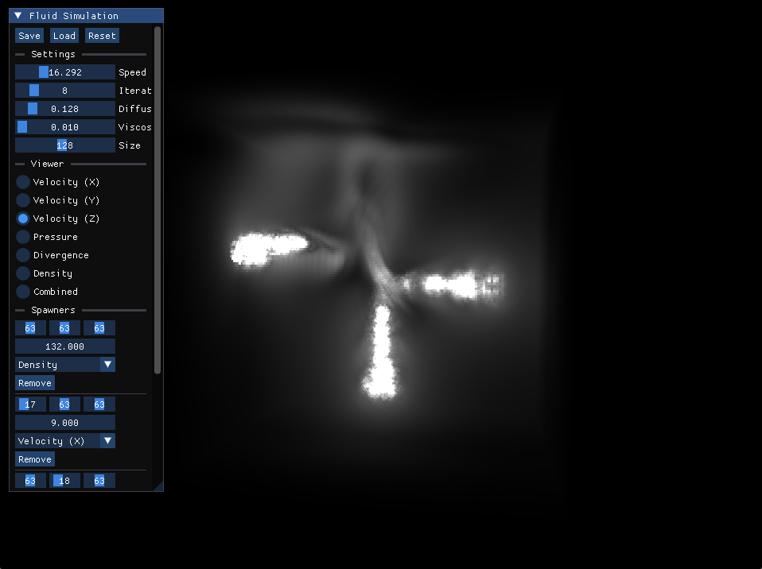

# Fluid Simulation

https://github.com/user-attachments/assets/b8a3aa68-71fe-4f7f-8786-0786772a1f35




Implementation of [Fluid Simulation for Dummies](https://mikeash.com/pyblog/fluid-simulation-for-dummies.html) using the new SDL3 GPU API with compute shaders

### Building

#### Windows

Install the [Vulkan SDK](https://www.lunarg.com/vulkan-sdk/) for glslc

```bash
git clone https://github.com/jsoulier/fluid_simulation --recurse-submodules
cd fluid_simulation
mkdir build
cd build
cmake ..
cmake --build . --parallel 8 --config Release
cd bin
./fluid_simulation.exe
```

#### Linux

```bash
git clone https://github.com/jsoulier/fluid_simulation --recurse-submodules
cd fluid_simulation
mkdir build
cd build
cmake .. -DCMAKE_BUILD_TYPE=Release
cmake --build . --parallel 8
cd bin
./fluid_simulation
```

#### Shaders

Shaders are prebuilt.
To build locally, install [SDL_shadercross](https://github.com/libsdl-org/SDL_shadercross) to your path