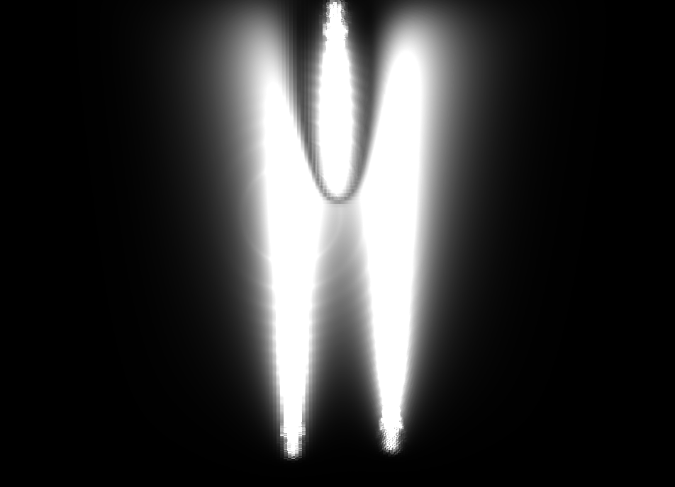
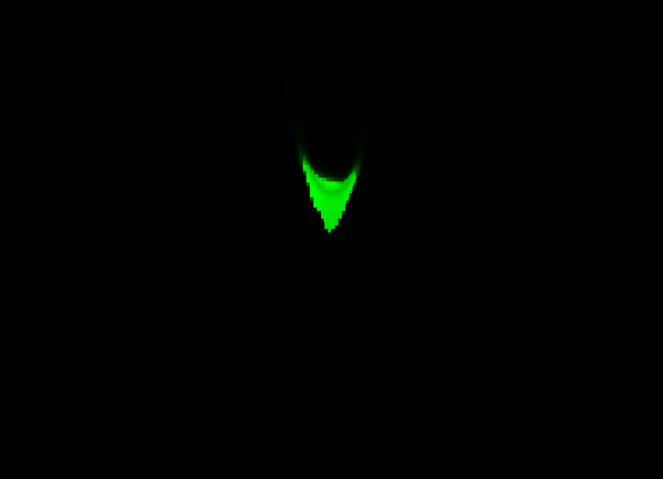
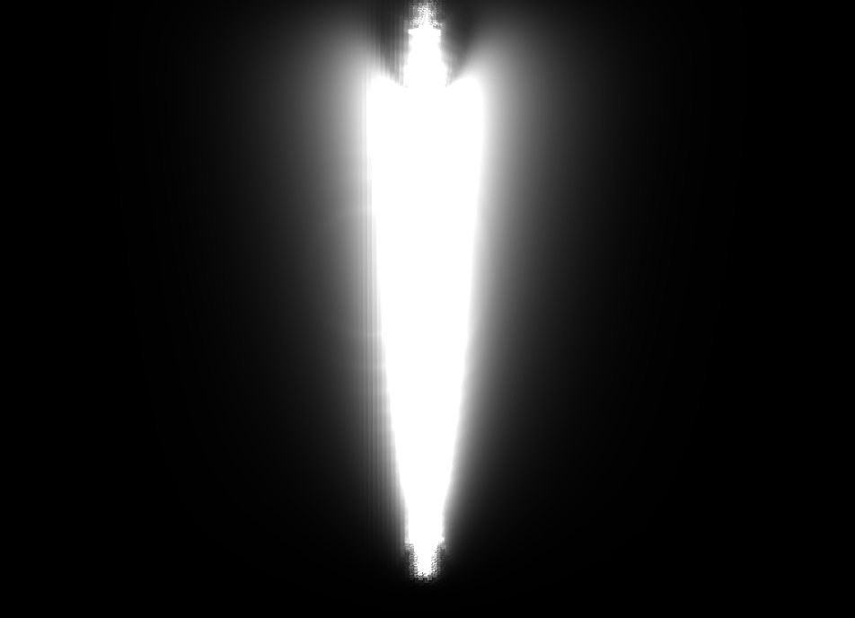
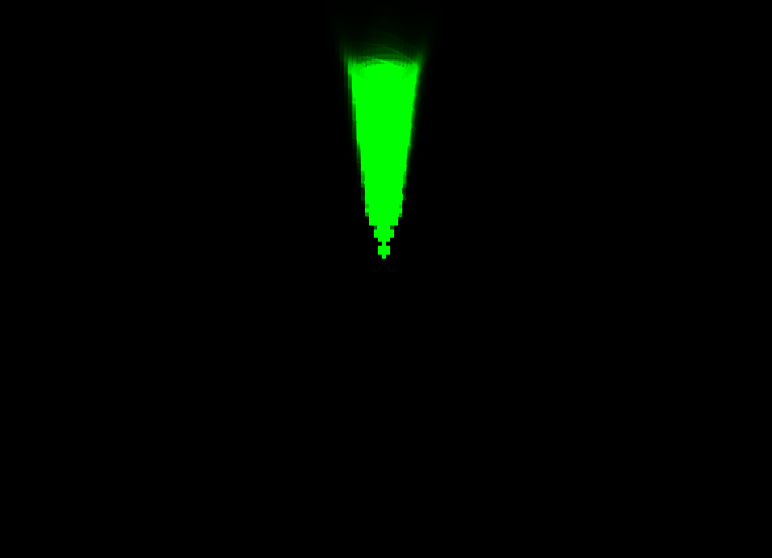
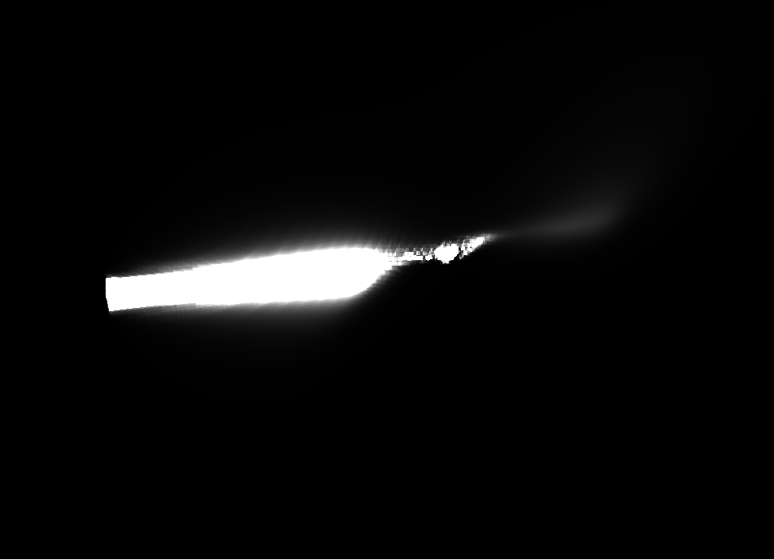
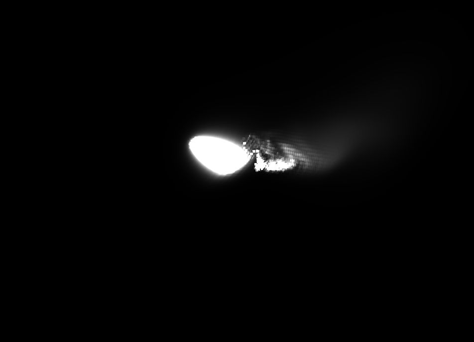
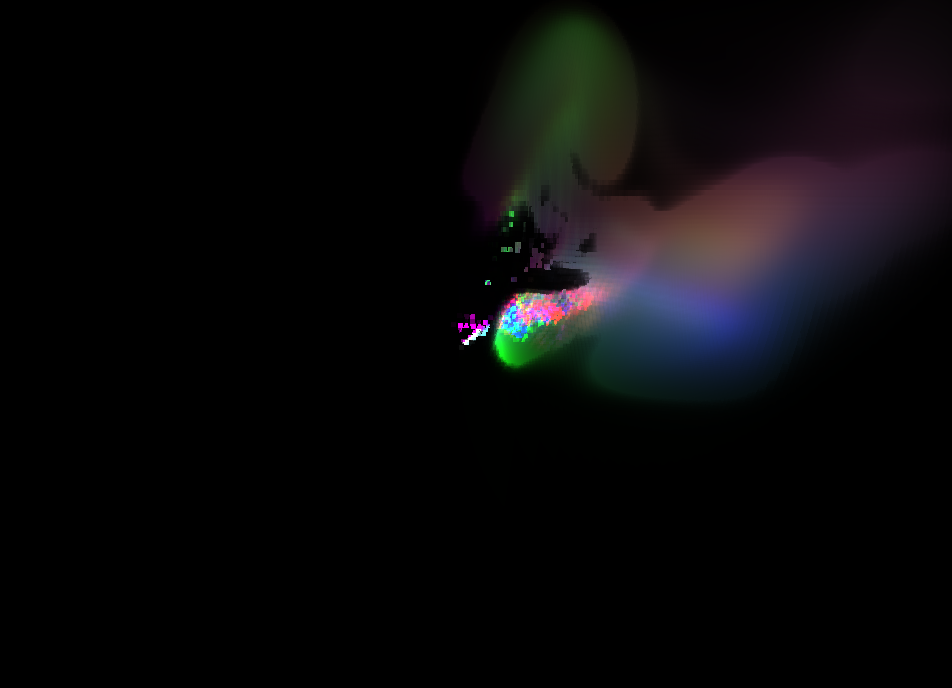

# 3D Fluid Simulation

https://github.com/user-attachments/assets/da450974-2e93-45e5-acac-0d70a1bbebc6

Implementation of [Fluid Simulation for Dummies](https://mikeash.com/pyblog/fluid-simulation-for-dummies.html) using the new SDL3 GPU API with compute shaders

### Building

#### Windows

Install the [Vulkan SDK](https://www.lunarg.com/vulkan-sdk/) for glslc

```bash
git clone https://github.com/jsoulier/3d_fluid_simulation --recurse-submodules
cd 3d_fluid_simulation
mkdir build
cd build
cmake ..
cmake --build . --parallel 8 --config Release
cd bin
./fluid_simulation.exe
```

#### Linux

```bash
git clone https://github.com/jsoulier/3d_fluid_simulation --recurse-submodules
cd 3d_fluid_simulation
mkdir build
cd build
cmake .. -DCMAKE_BUILD_TYPE=Release
cmake --build . --parallel 8
cd bin
./fluid_simulation
```

### Gallery

#### Offset Opposing


*Velocity (Y)*

*Colored Density*

#### Unbalanced Opposing


*Velocity (Y)*

*Colored Density*

#### Intersecting


*Velocity (X)*

*Velocity (Y)*

*Velocity (Z)*

*Colored Density*
