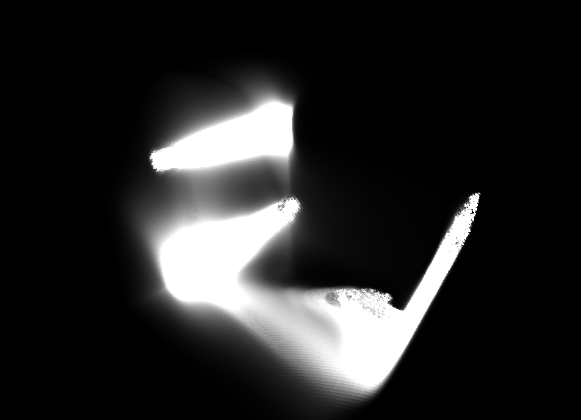
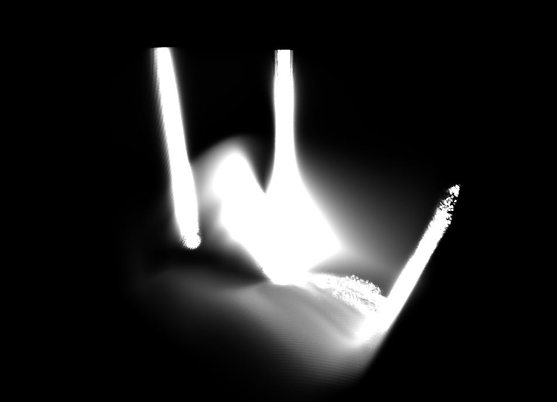
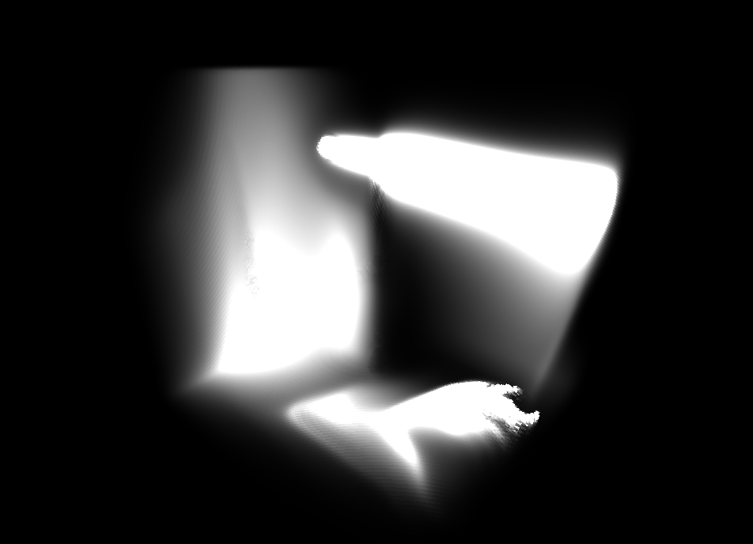
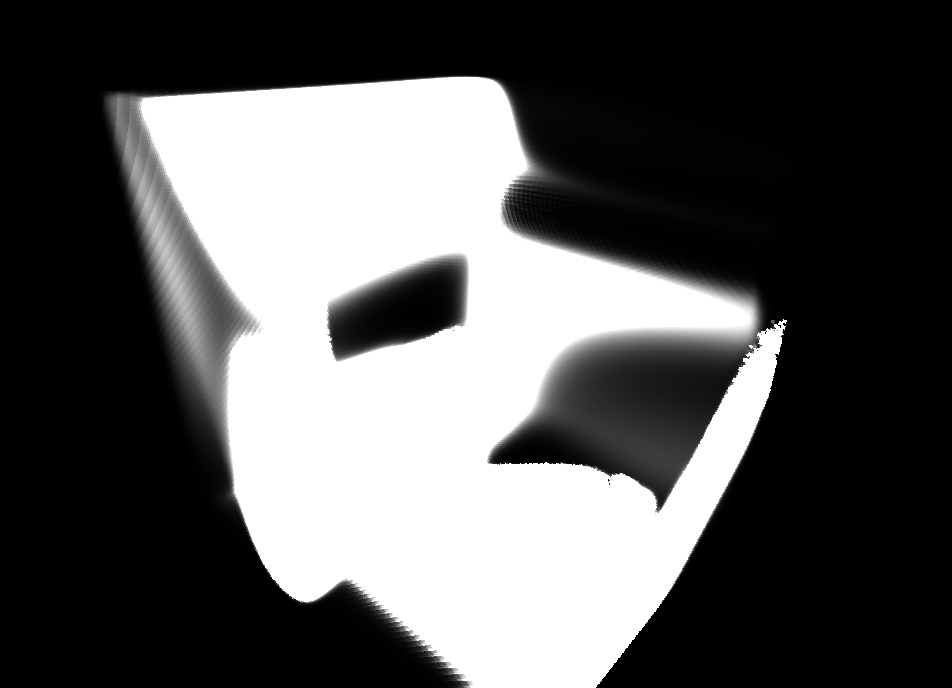
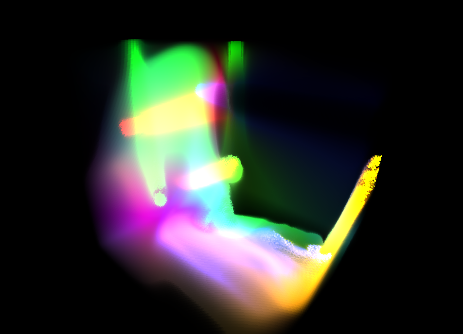

# 3D Fluid Simulation

https://github.com/user-attachments/assets/1ad166a8-c712-4bff-95cf-cbb520181d00

3D Fluid Simulation using SDL3 GPU with compute shaders

### Building

#### Windows

Install the [Vulkan SDK](https://www.lunarg.com/vulkan-sdk/) for glslc

```bash
git clone https://github.com/jsoulier/3d_fluid_simulation --recurse-submodules
cd 3d_fluid_simulation
mkdir build
cd build
cmake ..
cmake --build . --parallel 8 --config Release
cd bin
./fluid_simulation.exe
```

#### Linux

```bash
git clone https://github.com/jsoulier/3d_fluid_simulation --recurse-submodules
cd 3d_fluid_simulation
mkdir build
cd build
cmake .. -DCMAKE_BUILD_TYPE=Release
cmake --build . --parallel 8
cd bin
./fluid_simulation
```

### Images


*Velocity (X)*


*Velocity (Y)*


*Velocity (Z)*


*Density*


*Combined*

### References

- [Fluid Simulation for Dummies](https://mikeash.com/pyblog/fluid-simulation-for-dummies.html) by Mike Ash
